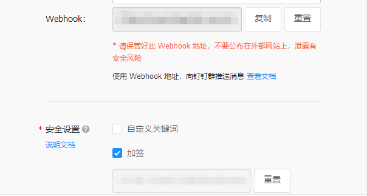

1. 创建群机器人，并记录webhook及加签密码



2. 简单调用

   ```python
   import requests
   import json
   import time
   import hmac
   import hashlib
   import base64
   import urllib
   from urllib import parse
   # 时间搓
   timestamp = round(time.time() * 1000)
   webhook = "https://oapi.dingtalk.com/robot/send?************"
   secret = 'SEC******************************'
   # 两者拼接起来
   string_to_sign = '{}\n{}'.format(timestamp, secret)
   # 加密
   hmac_code = hmac.new(secret.encode(), string_to_sign.encode(), digestmod=hashlib.sha256).digest()
   sing = urllib.parse.quote_plus(base64.b64encode(hmac_code))
   # 重新拼接webhook
   webhook = '{}&timestamp={}&sign={}'.format(webhook, str(timestamp), sing)
   # 请求头
   header = {
       "Content-Type": "application/json",
       "Charset": "UTF-8",
   }
   #请求数据
   message = {
       "msgtype": "text",
       "text": {
           "content": "1111"
       },
   }
   #转成json
   message_json = json.dumps(message)
   #发送数据
   info = requests.post(url=webhook, data=message_json, headers=header)
   print(info)
   ```

   