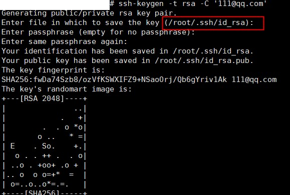

# git相关使用

## github免密码登入

1. 设置Git的user name和email

   ```shell
   git config --global user.name "zzj" 
   git config --global user.email "111@qq.com"
   ```

   

2. 创建秘钥

   ```shell
   ssh-keygen -t rsa -C '111@qq.com'
   ```

   

3. 找到秘钥



4. 打开秘钥并复制到github的settings的[SSH and GPG keys](https://github.com/settings/keys)

   

5. 修改 .ssh/config文件（可省略）

   * 目的能自定义key的路径

   ```shell
   vim .ssh/config
   Host github.com
        IdentityFile  .ssh/github
   ```

6. 测试git连接

   ```shell
    ssh  -Tv git@github.com
    Hi zzj0403! You've successfully authenticated, but GitHub does not provide shell access.
   ```

## git使用